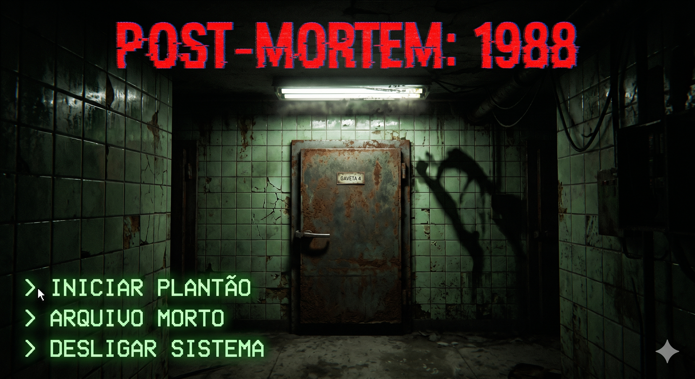
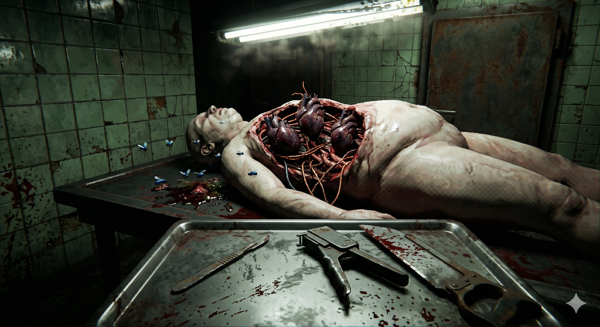
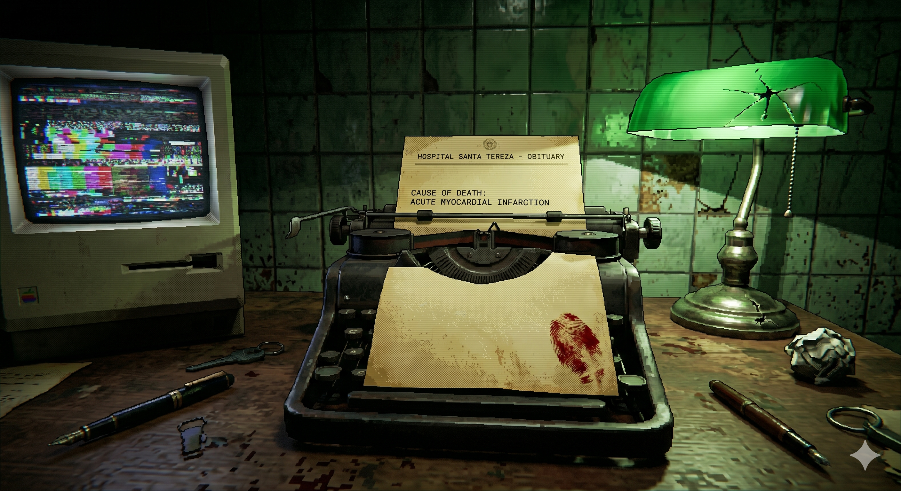

# 🩸 POST-MORTEM: 1988 - Game Design Document (GDD)

**HOSPITAL SANTA TEREZA — REPARTIÇÃO DE PATOLOGIA FORENSE**  
> **FORMULÁRIO DE REGISTRO E ADULTERAÇÃO DE ÓBITO | ANO: 1988**

* **IDENTIFICAÇÃO DO PROJETO:** POST-MORTEM: 1988
* **DESENVOLVEDOR:** Marcos Vinícius Nascimento Silva
* **CATEGORIA:** Jogo eletrônico de terror psicológico / Puzzle analógico diegético
* **MECÂNICA CORE:** Quebra-cabeça de combinação de tecidos e falsificação de laudos
* **AMBIENTAÇÃO:** Subsolo de um necrotério clandestino urbano (Anos 80)
* **DIRETRIZ ESTÉTICA:** Gore trash, visual Lo-Fi (estilo PS1), iluminação industrial decadente
* **INSPIRAÇÃO DIRETA:** *Buckshot Roulette* (2023) e *Inscryption* (2021)
* **STATUS DO DOCUMENTO:** USO RESTRITO – ARQUIVO MORTO DO LABORATÓRIO

---

## 💀 01. PANORAMA DO AMBIENTE E PREMISSA

Anos 80. À sombra dos necrotérios municipais legítimos, uma instalação clandestina opera sob o zumbido de lâmpadas tubulares que piscam freneticamente. Corpos vítimas de mutações grotescas, anomalias que desafiam a ciência e rastros de rituais profanos de uma facção oculta são despejados na sua mesa de metal. Se essas deformidades forem descobertas pela polícia ou pela imprensa, a organização inteira cai.

Em **POST-MORTEM: 1988**, o jogador assume o papel do patologista noturno coagido. Sua única missão é a sobrevivência. Para isso, ele precisa realizar o trabalho sujo: extirpar os órgãos deformados, esconder parasitas alojados na carne e adulterar o laudo de obituário oficial, forçando o sistema a arquivar o caso sob uma causa de morte comum (como enfarte agudo do miocárdio ou acidente doméstico).

O terror se manifesta no fato de que os tecidos expostos ainda reagem; a biologia distorcida pulsa na mesa de cirurgia e qualquer erro mecânico ou inconsistência textual pode fazer o cadáver despertar de forma violenta.

---

## 💡 02. PROPOSTA DE VALOR (PITCH)

O que acontece quando seu sustento depende de esconder monstros da sociedade, mas o erro em um único corte transforma você no próximo cadáver da mesa? POST-MORTEM: 1988 coloca o jogador no epicentro desse dilema: um técnico cercado por carne, ferramentas enferrujadas e segredos biológicos letais.

**Por que este projeto se destaca?**
* **O Gore como elemento ativo do puzzle:** O sangue e as deformidades não são meramente visuais; eles borram a visão do jogador, danificam os papéis do obituário e exigem ações físicas constantes de limpeza.
* **Mecânicas de interação puramente táteis:** O jogador manipula ferramentas pesadas e rústicas dos anos 80 (bisturis cegos, serras elétricas de ossos, grampeadores de pele) para resolver enigmas orgânicos complexos.
* **Estética Trash e Nostalgia Analógica:** A escolha pelo visual retrô estilizado lo-fi embaça o realismo exagerado, transformando a atmosfera em uma experiência estilosa, intimidadora e de forte apelo visual para transmissões online.
* **Tensão em formato de jogo de mesa:** Concentra toda a jogabilidade em uma única escrivaninha de autópsia, onde cada decisão mecânica carrega o peso imediato de vida ou morte.

---

## ⚙️ 03. O PATOLOGISTA E O CICLO DE TRABALHO (LOOP CENTRAL)

### O Técnico Coagido
O jogador opera em perspectiva de primeira pessoa na mesa de autópsia. Não há armas de fogo ou barras de vida tradicionais. Os únicos recursos disponíveis são os corpos, o inventário físico espalhado pela bancada, um monitor CRT chuviscando e uma máquina de escrever antiga para preencher o obituário.

### O Loop de Sobrevivência
A cada turno (uma noite de plantão no necrotério), o fluxo de jogo se desenvolve através das seguintes etapas:

1. **Leitura da Causa Real:** O jogador analisa o prontuário interno contendo a verdadeira bizarrice que matou o sujeito (ex: ninho de parasitas no ventrículo esquerdo).
2. **O Ritmo do "Coração-Bomba" (Puzzle de Sincronia):** Para interagir com os tecidos infectados sem sofrer um contra-ataque reflexo do cadáver, o jogador deve cortar ou extrair projéteis precisamente no contratempo do batimento ectópico do órgão mutante.
3. **Controle de Ruído e Luz (Furtividade Ativa):** Usar a serra elétrica de ossos gera ruídos que atraem entidades dos dutos de ventilação do teto. O jogador precisa monitorar a agulha de som, desligar as luzes nos momentos críticos e segurar a boca do cadáver para abafar gases pós-morte.
4. **O Contrabando de Órgãos (Economia):** O jogador pode extrair tecidos anômalos raros para vender ao mercado negro de feitiçaria, gerando fundos para comprar formol ou ferramentas melhores, arriscando deixar o laudo inconsistente e atrair a desconfiança policial.
5. **Assinatura do Obituário Falso:** Digitar a causa forjada na máquina de escrever, carimbar e submeter o relatório antes do amanhecer.

---

## 🧩 04. MATRIZ DE ADULTERAÇÃO BIOLÓGICA

| ELEMENTO DA AUTÓPSIA | MECÂNICA DE PUZZLE E ALTERAÇÃO |
| :--- | :--- |
| **Laudo de Obituário** | Digitar a narrativa falsa na máquina de escrever, rasurar termos como "garras" e carimbar a liberação do corpo. |
| **Tecidos e Órgãos Mutantes** | Desativar reações nervosas interligando tendões e fios elétricos expostos no peito do cadáver antes de puxar o órgão com a pinça. |
| **Lacerações e Cortes** | Fechar ferimentos profundos com grampos ou costura pesada; se a tensão interna subir, a linha rompe e o sangue borra a visão. |
| **Placas de Raio-X** | Aplicar raspagem química na película para apagar sombras de estruturas ósseas não-humanas ou objetos inseridos. |
| **Fluidos e Toxinas** | Injetar dosagens milimétricas de ácido ou formol para queimar fluidos fluorescentes sem dissolver as evidências físicas da carcaça. |
| **Rotação da Serra de Ossos** | Dosar a pressão do gatilho mecânico da serra; cortes brutos geram ruído extremo e calor, arruinando a barra de furtividade. |

---

## ⚠️ 05. TENSÃO, INFECÇÃO E FALHA CRÍTICA

O subsolo do hospital reage agressivamente aos erros do jogador:

* **Falha de Sincronia:** O cadáver desfere um espasmo violento, causando dano físico à sanidade do jogador e derramando fluidos na mesa, o que exige limpeza imediata.
* **Alerta Sonoro Máximo:** A criatura dos dutos desce para inspecionar a sala. O jogador deve congelar qualquer movimento, apagar as luzes e prender a respiração no escuro.
* **Erros de Laudo:** Se a mentira escrita no obituário for incoerente com o estado visual do corpo processado, o hospital bloqueia os recursos da noite seguinte e a polícia abre investigações.
* **Morte Forense (Game Over):** A integridade mental é pulverizada ou o espécime na mesa desperta por completo. A tela sofre uma distorção severa estilo fita magnética VHS destruída.

---

## 📻 06. AMBIENTAÇÃO SENSORIAL E IDENTIDADE RETRÔ

* **Interface Diegética:** Absolutamente nenhum menu flutuante. O inventário é a própria mesa imunda. Para preencher o obituário, o jogador ajusta fisicamente o papel nos rolos da máquina de escrever.
* **Paleta Cromática:** Tons doentios de verde hospitalar decrépito, marrom ferrugem, cinza industrial e o contraste agressivo do vermelho denso dos fluidos corporais.
* **Áudio Atmosférico:** O zumbido elétrico dos refrigeradores de corpos, moscas varejeiras voando perto da lâmpada, o som metálico e seco das pinças cirúrgicas e estática de rádio ao fundo.
* **Tipografia:** Tipos ásperos de máquina de escrever mecânica antiga e carimbos vermelhos com tinta falhada.

---

## 🎯 07. PÚBLICO-ALVO E POTENCIAL DE MERCADO

### Segmentos Primários
* **Fãs de terror analógico e simuladores de mesa:** Jogadores atraídos pela tensão de microgerenciamento em ambientes hostis e dinâmicos (entusiastas de Buckshot Roulette, Inscryption e Iron Lung).
* **Consumidores de subgêneros de terror corporal (Body Horror):** Público que aprecia estéticas viscerais, cinema gore trash dos anos 80 e narrativas perturbadoras de ficção científica/sobrenatural.
* **Comunidade entusiasta de jogos indie retrô:** Jogadores que priorizam identidades visuais estilizadas em baixa resolução (Lo-Fi / PS1 style) e mecânicas táteis imersivas.

### Segmentos Secundários
* **Espectadores e comunidades de streaming:** Jovens (18–30 anos) que consomem gameplays de terror no YouTube e Twitch, onde o fator choque e a reação do jogador geram alto engajamento viral.

### Diferenciais Competitivos
* Simulador de autópsia clandestina focado na fusão inédita entre quebra-cabeças biológicos táteis e falsificação de documentos textuais.
* Estilização de gore trash que transforma o terror visual em mecânica de jogo ativa (sangue que borra a tela, controle físico de pânico e som).

---

## 📚 08. REFERÊNCIAS E PILARES CRIATIVOS

| REFERÊNCIA | O QUE INSPIRA EM POST-MORTEM: 1988 |
| :--- | :--- |
| **Buckshot Roulette (2023)** | A atmosfera opressiva de jogo de azar e morte em cima de uma mesa, onde cada ação mecânica gera uma consequência imediata e tensa. |
| **Inscryption (2021)** | A interação puramente diegética e tátil com os objetos espalhados pela bancada, misturando puzzles enigmáticos e terror psicológico. |
| **Autopsy Simulator (2024)** | O rigor processual da análise anatômica de cadáveres e a manipulação de tecidos, adaptados aqui para uma escala retrô e ficcional. |
| **Cinema Gore Trash (Anos 80)** | Efeitos práticos exagerados, sangue denso, monstros biológicos e a decadência urbana, traduzidos em gráficos de baixa resolução. |
| **Foley e Efeitos Sonoros Analógicos** | O uso do design de áudio (zumbido de moscas, estática de TV, serras elétricas) como a principal ferramenta de feedback para o jogador. |

---

## 📖 09. VISÃO NARRATIVA

**POST-MORTEM: 1988** é sobre um trabalhador comum, quebrado pelo sistema e preso em um subsolo úmido limpando os vestígios de uma realidade que ele sequer compreende por completo. O patologista não tem armas para se defender, não busca desmantelar a seita secreta e não faz discursos morais. Ele tem apenas uma lâmpada tubular piscando, uma bandeja de ferramentas enferrujadas, uma monstruosidade fria na sua frente e o desespero para voltar vivo para casa ao amanhecer.

A narrativa desenvolve-se de maneira silenciosa através dos fragmentos biológicos de cada corpo, o homem que foi consumido por um parasita que substituiu seus órgãos por fiação elétrica, o corpo coberto de marcas ritualísticas cujos pulmões exalam um gás tóxico consciente, a vítima de assassinato da facção que precisa ser costurada às pressas. Cada cadáver que chega na mesa conta uma história brutal, e cada laudo falsificado na máquina de escrever é uma barganha com a própria sanidade.

O jogo apresenta o horror corporal e o sufoco econômico de forma crua, ambígua e grotesca, onde vender um órgão mutante no mercado negro pode ser a única forma de comprar o formol que te impede de morrer asfixiado na noite seguinte.

---

## 📊 10. ANÁLISE DE VIABILIDADE TÉCNICA E COMERCIAL

### Sumário das Colunas de Análise
* **DEMANDA:** Classifica a necessidade do projeto. Classificado como "Necessita-se" (proposta inédita de simulação burocrática aplicada ao subgênero do terror corporal tátil na mesa de jogo).
* **ENTENDIMENTO:** Como os usuários absorvem a experiência de primeira viagem (Macabro, Tenso, Grotesco, Viciante, Cômico - Trash).
* **DESENVOLVIMENTO:** Avaliação de complexidade. Classificado como Complexo pelo balanceamento dos puzzles de sincronia orgânica e sistema de som da IA.
* **IMPLEMENTAÇÃO:** Exigência de tecnologias externas. Classificado como Zero (recursos nativos das engines de mercado sustentam todo o escopo).
* **RESULTADO:** Impacto comercial e cultural esperado (Impacto Visual, Viral, Memorável, Nichado).
* **EVOLUÇÃO DO PROJETO:** Maturação do ecossistema. Classificado como Redesign (evolução estritamente autoral por design de novos corpos e cenários).

### Tabela de Viabilidade

| DEMANDA | ENTENDIMENTO | DESENVOLVIMENTO | IMPLEMENTAÇÃO | RESULTADO | MÉTODO DE PROGRESSÃO |
| :--- | :--- | :--- | :--- | :--- | :--- |
| **Necessita-se** | Macabro Tenso Grotesco Viciante Cômico (Trash) | **Complexo** | **Zero** | Impacto Visual Viral Memorável Nichado | **REDESIGN** |

### Leitura da Análise do Projeto
* **DEMANDA (Necessita-se):** O projeto resolve uma saturação no mercado de jogos de terror de perseguição clichê. Ao fundir mecânicas de lógica textual (obituários falsificados) com quebra-cabeças de anatomia grotesca na mesa de jogo, estabelece-se um produto comercial altamente original, atendendo à demanda por títulos rápidos de alta imersão tátil.
* **ENTENDIMENTO (Macabro, Tenso, Grotesco, Viciante, Cômico - Trash):** A recepção pelo público-alvo e criadores de conteúdo é instantânea devido ao apelo do choque visual e da ironia contida nas tarefas. Os gráficos lo-fi atenuam o fotorrealismo incômodo, transformando o "gore" em uma assinatura estilística divertida, altamente compartilhável e viciante.
* **DESENVOLVIMENTO (Complexo):** O desafio criativo e técnico não está no uso de códigos impossíveis, mas no balanceamento dos sistemas dinâmicos. Integrar as janelas de batimentos do "coração-bomba", a emissão de ruído das serras mecânicas e a digitação técnica das informações nos laudos exige um planejamento cirúrgico de variáveis de gameplay.
* **IMPLEMENTAÇÃO (Zero):** Não há barreiras tecnológicas para a execução do escopo. Motores de jogo acessíveis (Godot ou Unity) oferecem sistemas de física de clique, manipulação de interfaces tridimensionais e shaders prontos para emular a estética de fitas cassete e consoles antigos, garantindo um desenvolvimento sem custos de licença de software.
* **RESULTADO (Impacto Visual, Viral, Memorável, Nichado):** O jogo é estruturado com foco na viralização orgânica nas plataformas de streaming (Twitch e YouTube), impulsionado pelos sustos mecânicos e pela tomada rápida de decisões de risco econômico. Conquista um posicionamento memorável no mercado independente pela ousadia mecânica e identidade visual agressiva.
* **EVOLUÇÃO DO PROJETO (Redesign):** O amadurecimento técnico do título ocorre através de iterações deliberadas da equipe de design. Com base nas sessões de testes coletadas com jogadores, os níveis de bizarrice anatômica são atualizados, novos relatórios falsificados são escritos e o comportamento das entidades nos dutos de ar é modificado manualmente para otimizar o fluxo de diversão e o suspense.

---

## 🖼️ 11. CONCEPT ART & DIREÇÃO ESTÉTICA

As imagens a seguir servem como referências visuais de caráter estritamente ilustrativo. Elas foram geradas por meio de inteligência artificial generativa com o objetivo de tangibilizar a direção de arte, a interface diegética e a atmosfera "gore trash" pretendidas para o projeto.

### CONCEPT 01 — MENU PRINCIPAL
* **Descrição da Interface:** A tela inicial estabelece o tom do jogo em primeira pessoa. O jogador depara-se com a porta de ferro massiva e oxidada da "GAVETA 4" do necrotério. A tipografia do título apresenta distorções que emulam a estática de fitas magnéticas VHS. No canto inferior esquerdo, as opções de navegação simulam um terminal de computador antigo em fósforo verde com comandos pixelados, construindo a atmosfera claustrofóbica e industrial logo no primeiro contato.

### CONCEPT 02 — BANCADA DE TRABALHO E CORPO (GAMEPLAY CORE)
* **Descrição da Interface:** Demonstração da perspectiva central de jogabilidade. O cadáver apresenta a deformidade exposta com três corações pulsantes interconectados de forma anômala, cercado por insetos que reagem ao estado de decomposição. Na bandeja cirúrgica em primeiro plano, localizam-se as ferramentas interativas físicas (bisturi, grampeador cutâneo e serra de ossos). O sangue acumulado na bancada e nas ferramentas atua como feedback mecânico de erro ou precisão dos puzzles.

### CONCEPT 03 — ESTAÇÃO DE REDAÇÃO E OBITUÁRIO
* **Descrição da Interface:** Visão lateral da mesa de autópsia, com foco no preenchimento do obituário falso. Destaca-se a máquina de escrever mecânica contendo o formulário oficial com marcas de fluidos e uma impressão digital de sangue, indicando a urgência do trabalho. À esquerda, o monitor CRT distorcido e piscante exibe os ruídos do sistema, enquanto a icônica luminária de banqueiro com a cúpula verde trincada fornece a iluminação focal para a resolução dos puzzles textuais.

---
> **[ REGISTRO ENVIADO PARA O ARQUIVO MORTO DO HOSPITAL ]**