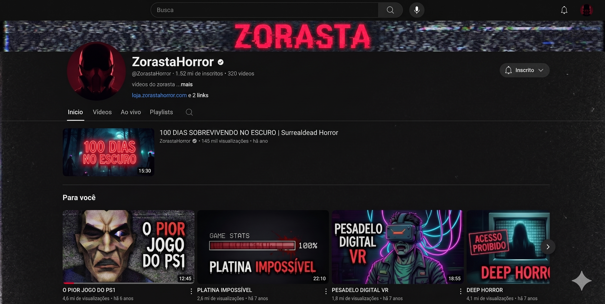

# 📼 PROJECT ZORASTAHORROR - Media Planning Document

**Universidade Federal do Agreste de Pernambuco (UFAPE)**  
**Curso:** Sistemas de Informação (6º Período)  
**Aluno:** Marcos Vinícius Nascimento Silva  

---

> **Status do Projeto:** Planejamento de Pré-Produção e Criação de Conteúdo
> **Nicho:** YouTube / Terror de Sobrevivência / Retro Horror (PS1/PS2)   
> **Mecânica Core:** Vídeo-ensaios de Platinas, Desafios Zumbi e Curadoria Retrô
> **Estética:** Dark Aesthetic, VHS, Lo-Fi, atmosfera sombria

---

## 💀 01. Panorama do Nicho e Premissa

O YouTube gamer brasileiro de terror é muito focado na reação exagerada: o criador joga o lançamento, toma um susto, grita pra câmera e o vídeo acaba. O **ZorastaHorror** entra no vácuo de quem quer um conteúdo mais profundo, técnico e obscuro.

A premissa é construir um "arquivo" dedicado a dissecar jogos de terror clássicos, indies bizarros e grandes franquias de *Survival Horror*. O espectador não entra só para tomar susto; ele entra para ver documentários sobre como é platinar um jogo impossível, como sobreviver a apocalipses zumbis com regras estúpidas, e para descobrir jogos retrô que foram esquecidos pelo tempo.

## 💡 02. Proposta de Valor (Pitch)

Transformamos o sofrimento e o medo em narrativas cativantes.

* **A Caça à Platina no Terror:** A jornada exata, cheia de frustração e alívio, para fazer 100% das conquistas em jogos como *Resident Evil*, *Dead Space*, *Amnesia* ou *Outlast*.
* **Desafios Absurdos:** Jogar de forma completamente limitante. Ex: "Sobrevivi 100 dias no apocalipse zumbi sendo completamente cego" ou "Zerei *Silent Hill* sem usar itens de cura".
* **O Garimpo Retrô (Trash/VHS):** Trazer jogos com visual de PS1 e *gore trash* (como títulos da *Puppet Combo*) e explicar a história por trás deles.
* **Monetização Fechada (Membros):** Disponibilizar "Rotas de Platina em PDF", *save states* específicos e mapas detalhados de sobrevivência, disponíveis apenas para os assinantes do canal.

## ⚙️ 03. O Ciclo de Conteúdo (Loop Central)

O canal não trabalha com gameplays brutos e sem edição. Tudo funciona no formato de *Video Essay* (vídeo-ensaio documentário).

1. **A Pauta:** Escolher o jogo de terror e o desafio. (Ex: "Fui platinar o jogo de terror mais perturbador do PS2").
2. **O Grind (Gravação):** Jogar e gravar todas as dezenas de horas, capturando as mortes, os sustos e a exaustão mecânica.
3. **O Roteiro:** Escrever a história dessa jornada, destacando as quebras de sanidade e o triunfo final.
4. **A Edição Atmosférica:** Transformar 30 horas de jogo em 20 minutos dinâmicos.

## 🧩 04. Matriz de Quadros do Canal

| Quadro | Mecânica e Foco do Conteúdo |
| :--- | :--- |
| **Platina Macabra** | Vídeos relatando a dor e a glória de platinar jogos de *Survival Horror*. Mostrando os troféus mais fáceis, os mais difíceis e o grind para os 100%. |
| **Regras do Manicômio** | Desafios onde o jogo é quebrado por restrições (Ex: apocalipses zumbis intensos no *Surroundead* com armas brancas apenas e inventário limitado). |
| **Arquivo VHS** | Vídeos focados em jogos obscuros de terror retrô, creepypastas jogáveis e games independentes de nicho. |

## ⚠️ 05. Tensão, Algoritmo e Retenção

Para o canal crescer, precisamos hackear a retenção:
* **Thumbnails (Capas):** Alto contraste, estilo *Dark Aesthetic*. O rosto do monstro ou o título do jogo em letras de neon/sangue, e um texto chamativo ("Platina Impossível").
* **Gancho de 10 Segundos:** Todo vídeo começa com o momento de maior tensão ou comemoração da platina, antes de cortar para a introdução.
* **Interação Orgânica:** As enquetes na aba comunidade definem o próximo conteúdo. "Qual jogo retrô de terror vocês querem ver eu sofrer para platinar mês que vem?".

## 📻 06. Ambientação Sensorial e Identidade da Marca

* **Edição Diegética:** Transições simulando glitches de fitas VHS perdidas, estática de TVs antigas e ruídos de áudio analógico.
* **O Áudio e Trilha Sonora:** A narração é controlada, como um diário de sobrevivente. Nas montagens aceleradas de *grind* ou fulga, a edição corta para faixas pesadas de *Phonky-Techno* e *Hardstyle* para ditar o ritmo de alta performance, contrastando com o silêncio absoluto nas áreas de tensão.
* **Estúdio/Câmera:** Minimalista e focado no *Dark Aesthetic*. Iluminação indireta e sombria.

## 🎯 07. Público-Alvo e Potencial de Mercado

### Segmentos Primários
* Fãs Hardcore de Terror (Resident Evil, Silent Hill, Outlast).
* Caçadores de Conquistas (*Completionists*).
* Saudosistas do Retrô (Visual de PS1 e PS2).

### Diferenciais Competitivos
Oferecer PDFs com "Rotas Otimizadas de Platina de Survival Horror" ou pacotes de *mods* configurados para desafios de zumbis exclusivos para assinantes. É a junção do entretenimento documental com a utilidade prática.

## 📊 08. Análise de Viabilidade Técnica e Comercial

* **Demanda e Entendimento:** A demanda por vídeo-ensaios narrativos de jogos (ao invés de gameplays vazios) está explodindo. Unir isso ao nicho muito fiel do terror retrô e desafios zumbis garante uma comunidade altamente engajada.

* **Desenvolvimento:** A gravação é simples, mas a edição e roteirização são "Complexas". Assistir a 30 horas de gravações para picotar apenas os 20 minutos perfeitos exige um fluxo de trabalho (pipeline) muito organizado.

* **Implementação:** Custo zero. Requer apenas software de edição (Premiere ou DaVinci), o OBS Studio para capturar a tela e um microfone com boa redução de ruído.

* **Resultado e Progressão:** Vídeos de "Como platinei..." têm vida longa (Long-tail), pois as pessoas continuam buscando isso anos depois. O canal cresce por retroalimentação: os comentários validam quais jogos nostálgicos ou bizarros devem ser o tema do próximo mês.

---

### 🖼️ 09. Concept Art - Identidade Visual do Canal

